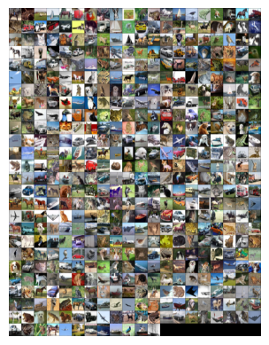
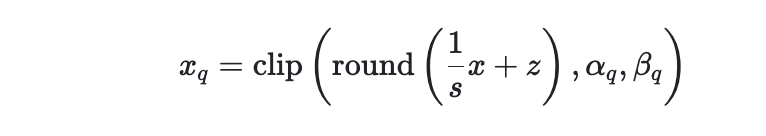
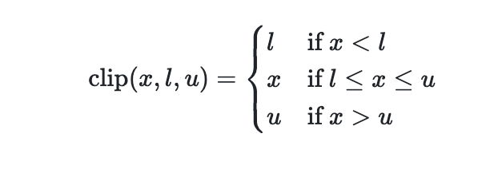
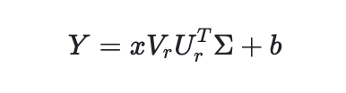
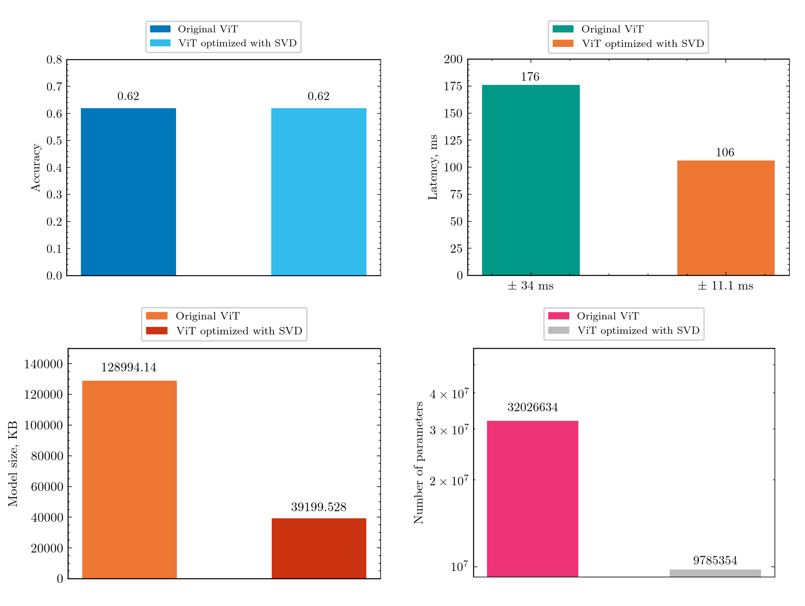
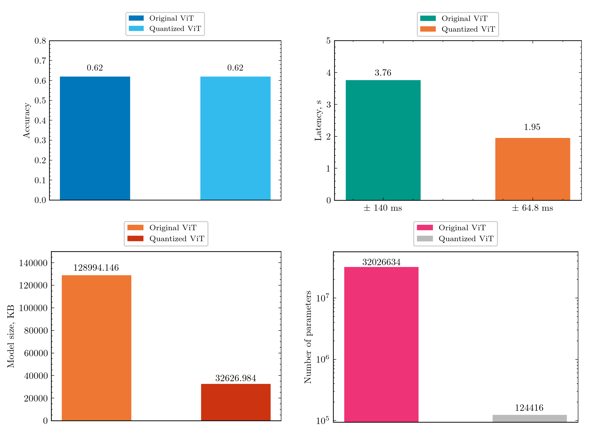

# ViTyaQua

<p align="center">
    
</p>

## Problem Description
This project explores singular value decomposition (SVD) and linear quantization as compression techniques tailored for Visual Transformer models (ViT). 

## Idea
Usage of SVD and linear quantiation as compression techniques for ViT.

## Dataset Description
We use publicly available dataset for neural network optimization problem: [CIFAR-10 homepage](https://www.cs.toronto.edu/~kriz/cifar.html).

The CIFAR-10 dataset is a widely used benchmark dataset in computer vision, particularly for image classification tasks. Developed by the Canadian Institute for Advanced Research (CIFAR), this dataset consists of 60,000 32x32 color images in 10 different classes, with each class containing 6,000 images. CIFAR-10 serves as a standard dataset for evaluating the performance of machine learning and deep learning models on image recognition tasks.

**Dataset Split**

Typical split into training and test sets was performed, with 50,000 images used for training and 10,000 images reserved for testing.

<p align="center">
    
</p>

<p align="center">
Figure 2 - Samples from CIFAR10 dataset
</p>

## ViT Model
Our implementation of [ViT](https://arxiv.org/abs/2010.11929) model was used in the project.

## Quantization

Quantization maps a floating-point value $x \in [\alpha, \beta]$ to a $b$-bit integer $x_q \in [\alpha_q, \beta_q]$.

The de-quantization process is defined as $x = s(x_q + z)$, and the quantization process is defined as $x_q = \text{round}\left(\frac{1}{s}x - z\right)$, where $c$ and $d$ are variables.

In practice, the quantization process may produce $x$ outside the range $[\alpha, \beta]$, that is why clipping is introduced:
<p align="center">
    
</p>

where $\text{clip}(x, l, u)$ is defined as:
<p align="center">
    
</p>

## Singlular Value Decomposition

Suppose we perform the matrix multiplication $Y = XW^T + b$, where $X \in \mathbb{R}^{m \times p}$, $W \in \mathbb{R}^{n \times p}$, and $b \in \mathbb{R}^n$ resulting in $Y \in \mathbb{R}^{m \times n}$. \
We can decompose $W = U \Sigma V^T$, where $U \in \mathbb{R}^{n \times n}$ and $V \in \mathbb{R}^{p \times p}$ are orthogonal matrices. \
$\Sigma$ is a matrix of singular values. We consider only $r < min(p, n)$ singular values to reconstruct matrix $W =>$ $U_r = \mathbb{R}^{n \times r}$, $V_r \in \mathbb{R}^{p \times r}$ and $\Sigma \in \mathbb{R}_+^{r \times r}$. 
We transpose matrix of weights. Thus, $W^T \in \mathbb{R}^{p \times n}$.

In this case we can rewrite $Y$ as:
<p align="center">
    
</p>

## How to Run Our Code?

### Run ViT_cifar10_pytorch_svd.ipynb to experiment with SVD

**Load original and SVD compressed models from checkpoint**

```sh
vit = ViTEncoder(in_ch = 3, 
                 d_model = 512, 
                 num_heads = 8, 
                 n_blocks = 10, 
                 num_classes = 10, 
                 mul = 4,
                 patch_size = 16, 
                 img_size = 224, 
                 dropout=0.1, 
                 device = device).to(device)
vit.load_state_dict(torch.load('./vit_model_state_cifar10_v3.pth', map_location=device))

# After you perform "Let us decompose linear layers section" you can load checkpoint for compressed model

vit.load_state_dict(torch.load('vit_cifar10_r100_best.pth'))
```

**Test models parameters**

```sh
# Number of parameters
n_params = 0
for p in vit.parameters():
    n_params += torch.numel(p)

print(f'Number of model parameters: {n_params}')

n_params_svd = 0
for name, param in vit.named_parameters():
      if param.requires_grad:
        n_params_svd += torch.numel(param)

print(f'Number of parameters in compressed model: {n_params}')

# Model size 
vit_svd = copy.deepcopy(vit)

for block in vit_svd.blocks:
    del block.sa.Q
    del block.sa.K
    del block.sa.V
    del block.sa.Out
    del block.ffn[0]
    del block.ffn[1]

# Latency estimation
%%timeit -n 10
with torch.no_grad():
    vit(x)

%%timeit -n 10
with torch.no_grad():
    vit.forward_svd(x)
```

**Test models performance**
```sh
# SVD
svd_model = ViTEncoder(in_ch = 3, 
                       d_model = 512, 
                       num_heads = 8, 
                       n_blocks = 10, 
                       num_classes = 10, 
                       mul = 4,
                       patch_size = 16, 
                       img_size = 224, 
                       dropout=0.1, 
                       device = device).to(device)
svd_model.load_state_dict(torch.load('./models/svd_model_state_cifar10.pth', map_location = torch.device(device)))

test_svd(vit, test_dataloader, True, device)
```

&nbsp;

### Run ViT_cifar10_pytorch_quantization.ipynb to experiment with quantization

**Load original model from checkpoint**
```sh
original_model = ViTEncoder(3, 512, 8, 10, len(classes), 4, 16, 224)
original_model.load_state_dict(torch.load('./models/vit_cifar10_v3.pt', map_location = torch.device('cpu')))
```

**Apply quantization**
```sh
quantized_model = torch.quantization.quantize_dynamic(original_model, {nn.Linear}, dtype=torch.qint8)
```

**Test models parameters**

```sh
# Model size
f = print_size_of_model(original_model, 'fp32')
q = print_size_of_model(quantized_model, 'int8')
print('Dynamic quantized model is {0:.2f} times smaller than original'.format(f / q))

# Latency estimation
input_size = (3, 224, 224) 
inputs = torch.randn(32, *input_size)
print('Floating point FP32: ')
%timeit original_model(inputs)
print('\nQuantized INT8: ')
%timeit quantized_model(inputs)

# Number of parameters comparison
print('Original model')
print(f'Number of weights:', np.sum([np.prod(p.shape) for p in model.parameters()]))
print('\nQuantized model')
print('Number of weights:', np.sum([np.prod(p.shape) for p in quantized_model.parameters()]))
```

**Test models performance**

```sh
original_model = ViTEncoder(3, 512, 8, 10, len(classes), 4, 16, 224).to(device)
original_model.load_state_dict(torch.load('./models/vit_cifar10_v3.pt', map_location = torch.device(device)))
quantized_model = torch.quantization.quantize_dynamic(original_model, {nn.Linear}, dtype=torch.qint8)

original_model.eval()
quantized_model.eval()

test_loss, test_acc = epoch_test(test_dataloader, original_model, criterion, device)
print(f'test loss: {test_loss:.3f}; test acc: {test_acc:.2f}')
```

## Code Reproducibility
You can run our training/testing procedure for both SVD and quantization techniques using [ViT_cifar10_pytorch_SVD.ipynb](./ViT_cifar10_pytorch_SVD.ipynb) and [ViT_cifar10_pytorch_quantization.ipynb](./ViT_cifar10_pytorch_quantization.ipynb) respectively.

Model checkpoints are available by [GoogleDrive](https://drive.google.com/drive/folders/197rhuvgJbaiL6Ktvd-E9Lp1wfHpw00VZ?usp=sharing).

**Available checkpoints:**
vit_model_state_cifar10_v3.pth (original pretrained ViT), vit_cifar10_r100_best.pth (ViT optimized with SVD, best), dyn_quant_model_state_cifar10.pth (quantized ViT).

## Experiments and Results
**Singular Value Decomposition (SVD)**

SVD was applied to linear layers of ViT (projection layers and linear layers in feed-forward neural network (FFNN) encoder layer).

<p align="center">
    
</p>

**Accuracy:** 0.62 -> 0.62 \
**Latency:** 176 s ± 34 ms -> 106 ms ± 11.1 ms \
**Model size:** 128 994.146 KB -> 39 199.528 KB \
**Model's number of parameters:** 32 026 634 -> 9 785 354.

&nbsp;

**Quantization**

**3 methods of post-training quantization from [PyTorch](https://pytorch.org/docs/stable/quantization.html#general-quantization-flow) were considered within this project:** dynamic quantization, static quantization, quantization aware.

Results below are presented for dynamic quantization as far as other methods were not successfully run due to backend compatibility problems.

<p align="center">
    
</p>

Dynamic quantization technique showed the best performance reducing model size while leaving the same accuracy as original: \
**Accuracy:** 0.62 -> 0.62 \
**Latency:** 3.76 s ± 140 ms -> 1.95 s ± 64.8 ms \
**Model size:** 128 994.146 KB -> 32 626.984 KB \
**Model's number of parameters:** 32 026 634 -> 124 416.

Also static quantization technique was implemented and tested for linear layers of ViT, however this procedure should be checked in advance to achieve significant results.


## Presentation
ViTyaQua final project defence in Numerical Linear Algebra course (19 December 2023, Eng, [slides](./presentation/ViTyaQua_presentation.pdf))

## Summary
In this study, we explored advanced compression techniques tailored for Visual Transformer models (ViT), demonstrating significant model size reduction without compromising performance: 

1. **Baseline ViT Performance:**
   - Trained [ViT](https://arxiv.org/abs/2010.11929) on the CIFAR-10 dataset for image classification.
   - Achieved an accuracy of 0.62 on inference.

2. **Singular Value Decomposition (SVD):**
   - Applied singular value decomposition (SVD) to linear layers of [ViT](https://arxiv.org/abs/2010.11929), specifically targeting projection layers and linear layers in the feed-forward neural network (FFNN) encoder layer.
   - Attained comparable accuracy on the quantized model, while reducing the model size to approximately 3.3 times smaller than the original.

3. **Dynamic Quantization:**
   - Performed experiments with dynamic quantization on [ViT](https://arxiv.org/abs/2010.11929).
   - Maintained high performance with the quantized model achieving the same accuracy as the original, while reducing the model size by a factor of 4.


The primary goal of compressing the original model size while preserving high performance was successfully realized. The adoption of both SVD and dynamic quantization offers flexible and effective strategies for optimizing ViT models, making them more resource-efficient without sacrificing accuracy.


## Citations

```plaintext
@techreport{cifar10,
    title={CIFAR-10 (Canadian Institute for Advanced Research)},
    author={Alex Krizhevsky and Vinod Nair and Geoffrey Hinton},
    year={2009},
    institution={CIFAR}
}

@inproceedings{dosovitskiy2020vit,
  title={An Image Is Worth 16x16 Words: Transformers for Image Recognition at Scale},
  author={Dosovitskiy, Alexey and Beyer, Lucas and Kolesnikov, Alexander and Weissenborn, Dirk and Zhai, Xiaohua and Unterthiner, Thomas and Dehghani, Mostafa and Minderer, Matthias and Heigold, Georg and Gelly, Sylvain and Uszkoreit, Jakob and Houlsby, Neil},
  booktitle={Conference on Neural Information Processing Systems (NeurIPS)},
  year={2020}
}

@article{lin2021fq,
  title={Fq-vit: Post-training quantization for fully quantized vision transformer},
  author={Lin, Yang and Zhang, Tianyu and Sun, Peiqin and Li, Zheng and Zhou, Shuchang},
  journal={arXiv preprint arXiv:2111.13824},
  year={2021}
}

@article{yuan2023asvd,
  title={ASVD: Activation-aware Singular Value Decomposition for Compressing Large Language Models},
  author={Yuan, Zhihang and Shang, Yuzhang and Song, Yue and Wu, Qiang and Yan, Yan and Sun, Guangyu},
  journal={arXiv preprint arXiv:2312.05821},
  year={2023}
}
```

## License
MIT License

Copyright (c) 2023 Matvey Skripkin, Nikolay Kalmylov, Nikita Vasilev, Nikita Ligostaev

Permission is hereby granted, free of charge, to any person obtaining a copy
of this software and associated documentation files (the "Software"), to deal
in the Software without restriction, including without limitation the rights
to use, copy, modify, merge, publish, distribute, sublicense, and/or sell
copies of the Software, and to permit persons to whom the Software is
furnished to do so, subject to the following conditions:

The above copyright notice and this permission notice shall be included in all
copies or substantial portions of the Software.

THE SOFTWARE IS PROVIDED "AS IS", WITHOUT WARRANTY OF ANY KIND, EXPRESS OR
IMPLIED, INCLUDING BUT NOT LIMITED TO THE WARRANTIES OF MERCHANTABILITY,
FITNESS FOR A PARTICULAR PURPOSE AND NONINFRINGEMENT. IN NO EVENT SHALL THE
AUTHORS OR COPYRIGHT HOLDERS BE LIABLE FOR ANY CLAIM, DAMAGES OR OTHER
LIABILITY, WHETHER IN AN ACTION OF CONTRACT, TORT OR OTHERWISE, ARISING FROM,
OUT OF OR IN CONNECTION WITH THE SOFTWARE OR THE USE OR OTHER DEALINGS IN THE
SOFTWARE.
